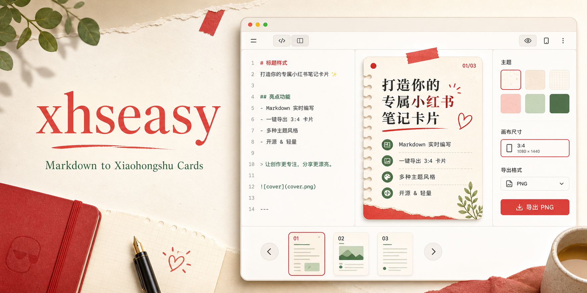

# xhseasy



<p align="center">
  <strong>把 Markdown 写作变成可直接发布的小红书竖图卡片。</strong>
</p>

<p align="center">
  <a href="https://www.xhseasy.top/">在线体验</a>
  ·
  <a href="https://www.xhseasy.top/xhs-markdown.md">Markdown 规范</a>
  ·
  <a href="https://www.xhseasy.top/components.md">组件文档</a>
  ·
  <a href="https://github.com/g0dam/xhseasy/issues">反馈问题</a>
</p>

<p align="center">
  <a href="https://github.com/g0dam/xhseasy/stargazers"></a>
  <a href="https://github.com/g0dam/xhseasy/forks"></a>
  <a href="https://github.com/g0dam/xhseasy/issues"></a>
  <a href="https://www.xhseasy.top/"></a>
  
  
  
</p>

## 这是什么

`xhseasy` 是一个浏览器端的小红书排版编辑器。你可以用熟悉的 Markdown 写内容，同时在右侧实时看到接近最终发布效果的竖图卡片，并把内容按 3:4 或 3:5 比例导出为 PNG。

它不是图文发布后台，也不接管账号、登录、私信或远程发布流程。它专注解决一个更具体的问题：让创作者、运营、知识博主和 AI 内容工作流，把一篇草稿快速变成清晰、好看、可保存、可发布的一组小红书图片。

## 为什么做

很多小红书内容不是输在观点，而是输在最后一公里：

- 写作工具适合长文，但不适合卡片化表达。
- 设计工具足够自由，但每次排版都要重新拖拽。
- AI 生成的正文能用，但很难稳定落到统一视觉模板里。
- 一篇笔记常常需要封面、目录、步骤、对比、FAQ、清单等固定结构。

`xhseasy` 把这些高频动作收敛成一个轻量编辑器：左侧写内容，右侧看卡片，底部看分页，最后逐页导出图片。

## 功能亮点

| 能力 | 说明 |
| --- | --- |
| Markdown 实时编辑 | 支持标题、列表、引用、代码块、分割线、图片插入和常见正文排版 |
| 小红书竖图预览 | 按 3:4 / 3:5 画布实时渲染，提前看到最终图片节奏 |
| 多主题模板 | 内置纸感笔记、极简白、杂志风、暗夜模式、手账风、复古报纸等视觉模板 |
| 结构化卡片 DSL | 使用 `xhs-page` 写封面、目录、步骤、时间线、对比、问答、清单、图库等页面块 |
| 图片处理 | 支持上传、粘贴图片，并在预览中调整宽度、圆角和高度 |
| 智能分页导出 | 自动按竖图比例切片，逐页导出 PNG，适合直接上传到小红书 |
| 本地优先 | 草稿和设置保存在浏览器本地，不需要后端账号体系 |
| Agent 友好 | 提供 `skill.md`、`llms.txt` 和组件文档，方便 AI 生成可落地的笔记 Markdown |

## 在线体验

访问官网：

```text
https://www.xhseasy.top/
```

给 AI 或自动化流程使用的入口：

- [Agent Skill](https://www.xhseasy.top/skill.md)
- [LLM Summary](https://www.xhseasy.top/llms.txt)
- [XHS Markdown](https://www.xhseasy.top/xhs-markdown.md)
- [XHS Components](https://www.xhseasy.top/components.md)
- [Visual Templates](https://www.xhseasy.top/templates.md)

## 快速开始

```bash
npm install
npm run dev
```

默认开发地址通常是：

```text
http://localhost:5173/
```

生产构建：

```bash
npm run build
```

本地预览构建产物：

```bash
npm run preview
```

## 使用方式

1. 在左侧输入 Markdown。
2. 选择适合内容的视觉主题和画布比例。
3. 使用 `xhs-page` 结构块组织封面、目录、步骤、对比或 FAQ。
4. 在右侧实时检查每张卡片的阅读节奏。
5. 上传或粘贴图片，并在预览中调整图片样式。
6. 确认分页后逐页导出 PNG。
7. 将图片上传到小红书，正文可继续复用 Markdown 草稿。

## `xhs-page` 示例

````markdown
```xhs-page
template: cover
title: 3 步写出更容易被收藏的小红书笔记
subtitle: 先定结论，再拆页面，最后导出竖图
badge: 今日方法
accent: red
```

```xhs-page
template: steps
title: 一篇笔记的稳定结构
steps:
  - title: 先给读者一个明确收益
    detail: 第一页不要铺背景，直接告诉读者能得到什么
  - title: 每页只讲一个重点
    detail: 让图片适合滑动浏览，而不是变成长文截图
  - title: 导出前检查节奏
    detail: 标题、留白、图片和结尾动作都要能一眼看懂
accent: inherit
```
````

更多组件写法见 [components.md](https://www.xhseasy.top/components.md)。

## 适合谁

- 内容创作者：把选题、提纲、正文快速变成可发布图片。
- 小红书运营：统一账号视觉风格，减少重复排版。
- 知识博主：把方法论、清单、对比、步骤拆成更容易收藏的卡片。
- AI 工作流用户：让大模型输出的 Markdown 直接进入稳定的视觉模板。
- 开发者：基于 React/Vite 二次开发自己的图文生成工具。

## 技术栈

- React 18
- TypeScript 5
- Vite 8
- marked
- DOMPurify
- html2canvas

整体架构保持在浏览器端：Markdown 解析、草稿持久化、图片占位、预览渲染和 PNG 导出都在本地完成。

## 项目结构

```text
xhseasy/
├── public/
│   ├── assets/                 # README 横图、默认头像、二维码等静态资源
│   ├── skill.md                # 给 AI Agent 使用的写作说明
│   ├── llms.txt                # 面向 LLM 的项目摘要
│   ├── xhs-markdown.md         # Markdown 写法说明
│   ├── components.md           # xhs-page 组件说明
│   └── templates.md            # 视觉模板说明
├── src/
│   ├── components/             # 编辑器、预览、模板选择、图片编辑等 UI
│   ├── document/               # Markdown 与文档模型转换
│   ├── markdown/               # Markdown 渲染和分段逻辑
│   ├── page-templates/         # xhs-page 结构化卡片 DSL
│   ├── panels/                 # 设置、快捷插入、表情等面板
│   ├── slicer/                 # 智能切片与 PNG 导出
│   ├── store/                  # 状态管理与本地持久化
│   ├── styles/                 # 应用样式与预览样式
│   ├── templates/              # 内置视觉模板
│   └── main.tsx                # 应用入口
├── index.html
├── package.json
├── tsconfig.json
└── vite.config.ts
```

## 核心设计

### 1. 内容和视觉解耦

作者主要写 Markdown 和结构化组件，不需要反复拖拽元素。主题负责字体、颜色、装饰、间距和卡片气质，内容可以在多个模板之间切换。

### 2. 先预览，再导出

小红书图片不是普通网页截图。编辑器会把内容放进固定比例画布，让你在导出前就能看到每页的标题密度、留白、图片位置和分页节奏。

### 3. 结构块降低重复劳动

封面、目录、步骤、对比、清单、FAQ、时间线这类内容很常见，所以 `xhseasy` 用 `xhs-page` 把它们变成可复用结构，而不是每次手工排版。

### 4. 对 AI 友好

项目暴露了 `skill.md`、`llms.txt`、组件说明和模板说明。AI 可以按这些规则生成 Markdown，用户再在浏览器里检查和导出，不需要 AI 猜测 UI 内部实现。

## 开发约定

- 优先保持小 diff，不做无关重构。
- 行为变化要优先补充或更新测试；当前项目暂无专门测试脚本时，至少运行 `npm run build`。
- 不把密钥、账号、令牌或 `.env` 内容写入代码和日志。
- 不新增遥测、分析脚本或额外网络调用，除非有明确需求。

## 贡献

欢迎提交 Issue 或 Pull Request，尤其是这些方向：

- 新的小红书视觉模板
- 更稳定的分页和导出策略
- 更多 `xhs-page` 结构组件
- 图片编辑和素材管理体验
- 文档示例、工作流模板和 Agent 使用说明

提交 PR 前建议先运行：

```bash
npm run build
```

## Star History

如果这个项目对你的内容工作流有帮助，欢迎点一个 Star。它能让更多需要“小红书 Markdown 到竖图卡片”工具的人更容易找到这个项目。

<p align="center">
  <a href="https://star-history.com/#g0dam/xhseasy&Date">
    
  </a>
</p>
